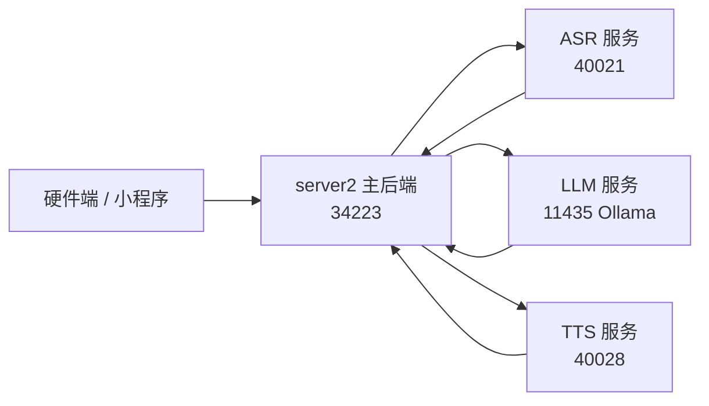

# Baby Bed Server2

智能婴儿床后端服务 API。这个版本是 `server2`，用于把业务后端、硬件端、ASR、LLM、TTS 统一到一条可联调的工作链路里。

当前目标是：

- 小程序前端继续保持统一入口
- 硬件端直接调用后端接口
- 语音链路统一走本地服务
- 对话、意图、播报都能闭环

---

## 当前架构



### 当前默认运行状态

- 主后端：`http://223.247.96.246:34223`
- ASR：`http://223.247.96.246:40021`
- LLM：`http://223.247.96.246:11435`
- TTS：`http://223.247.96.246:40028`

### 当前模型/引擎

- LLM：`gemma4:latest`
- ASR：`distil-large-v3-ct2` + `faster-whisper`
- TTS：demo 阶段可用 `F5TTS`；仓库里也保留了可切换到本地 MeloTTS 的实现

---

## 功能概览

- 设备注册、心跳、在线状态管理
- 传感器数据上报与清理
- 婴儿状态、风险等级、温湿度等记录
- 视频上传、视频流、视频封面图生成
- 语音识别 ASR
- 语音对话 LLM
- 语音播报 TTS
- 音色管理、音色切换、音色克隆
- 成长记录、温馨瞬间、作息管理

---

## 项目结构

```text
baby_bed_server2/
├── app/
│   ├── api/v1/         # API 路由
│   ├── core/           # 响应、异常、鉴权
│   ├── models/         # ORM 模型
│   ├── schemas/        # Pydantic 请求/响应
│   ├── services/       # 业务逻辑
│   └── utils/          # 工具函数
├── migrations/         # 数据库迁移
├── scripts/            # 维护脚本
├── tests/              # 测试
├── main.py             # FastAPI 入口
├── config.py           # 环境配置
├── gunicorn_conf.py    # 生产环境配置
├── uwsgi.ini           # UWSGI 配置
└── requirements.txt    # Python 依赖
```

---

## 快速启动

### 1. 安装 uv

```bash
curl -LsSf https://astral.sh/uv/install.sh | sh
source ~/.bashrc
```

### 2. 创建 Python 环境

```bash
cd /www/wwwroot/baby_bed_server2
uv venv --python 3.11.13 .venv
source .venv/bin/activate
uv pip install -r requirements.txt
```

### 3. 配置环境变量

在项目根目录创建 `.env`：

```env
# 数据库
DB_HOST=223.247.96.246
DB_PORT=3306
DB_USER=baby_bed_sql
DB_PASSWORD=baby_bed_sql
DB_NAME=baby_bed_sql

# JWT
JWT_SECRET_KEY=your-secret-key
JWT_EXPIRE_MINUTES=1440

# Redis
REDIS_HOST=127.0.0.1
REDIS_PORT=6379
REDIS_DB=0

# 大模型
LLM_API_URL=http://223.247.96.246:11435/v1/chat/completions
LLM_MODEL=gemma4:latest
VOICE_CHAT_LLM_MODEL=gemma4:latest
REPORT_LLM_MODEL=gemma4:latest

# 语音链路
ASR_API_URL=http://223.247.96.246:40021/speech-to-text
TTS_API_URL=http://223.247.96.246:40028/tts

# 语音克隆（如果仍需要外部服务）
VOICE_CLONE_API_URL=http://223.247.96.246:30028/v1/audio
```

### 4. 启动主后端

```bash
cd /www/wwwroot/baby_bed_server2
source .venv/bin/activate
gunicorn -c gunicorn_conf.py main:app
```

### 5. 运行开发模式

```bash
cd /www/wwwroot/baby_bed_server2
source .venv/bin/activate
uvicorn main:app --reload --host 0.0.0.0 --port 8000
```

---

## 三端联调顺序

建议按这个顺序启动，方便排查问题：

1. ASR
2. TTS
3. LLM
4. 主后端
5. 小程序/硬件端

### ASR 服务

```bash
cd /home/simon/voice_services/asr_fast
CUDA_VISIBLE_DEVICES=4 ASR_DEVICE=cuda ASR_COMPUTE_TYPE=float16 \
uv run uvicorn app:app --app-dir /home/simon/voice_services/asr_fast \
--host 0.0.0.0 --port 40021
```

### TTS 服务

demo 阶段你可以继续用当前跑在 `40028` 的 TTS 服务。  
如果后续切换为本地 MeloTTS，可直接启动仓库里预留的服务模块：

```bash
uv run uvicorn app.services.melotts_tts_app:app --host 0.0.0.0 --port 40028
```

### LLM 服务

你当前的 LLM 服务是 Ollama，默认接口：

```bash
http://223.247.96.246:11435/v1/chat/completions
```

模型名：

```text
gemma4:latest
```

### 主后端服务

```bash
cd /www/wwwroot/baby_bed_server2
gunicorn -c gunicorn_conf.py main:app
```

### 健康检查

```bash
curl http://223.247.96.246:40021/health
curl http://223.247.96.246:40028/health
curl http://223.247.96.246:11435
curl http://223.247.96.246:34223/api/v1/health
```

---

## API 总览

### 硬件端接口

无需 JWT，给硬件设备直接调用：

| 接口 | 方法 | 说明 |
|------|------|------|
| `/api/v1/device/register` | POST | 设备注册 |
| `/api/v1/hardware/heartbeat` | POST | 心跳与 baby_id 获取 |
| `/api/v1/sensor/upload` | POST | 传感器数据上传 |
| `/api/v1/sensor/status/upload` | POST | 婴儿状态与风险等级上报 |

### 应用端接口

需要 JWT：

| 模块 | 前缀 | 说明 |
|------|------|------|
| auth | `/api/v1/auth` | 登录认证 |
| device | `/api/v1/device` | 设备管理 |
| baby | `/api/v1/baby` | 宝宝管理 |
| family | `/api/v1/family` | 家庭管理 |
| routine | `/api/v1/routine` | 作息管理 |
| milestone | `/api/v1/milestone` | 成长记录 |
| voice | `/api/v1/voice` | 语音交互 |
| video | `/api/v1/video` | 视频识别 |
| interaction | `/api/v1/interaction` | 婴儿互动 |

---

## 语音链路说明

### 1. ASR

语音识别接口默认会转发到：

```text
POST http://223.247.96.246:40021/speech-to-text
```

支持两种输入方式：

- `multipart/form-data` 上传 `file`
- JSON 的 `audio_data`（base64）

### 2. LLM

当前对话、意图识别、报告生成默认走：

```text
gemma4:latest
```

对话提示词会尽量贴近婴儿照护场景，避免编造。

### 3. TTS

`server2` 的 TTS 逻辑会按家庭音色的 `voice_role` 优先选择声线。  
demo 阶段如果你仍用现有 TTS 服务，主后端会直接把请求转发到 `TTS_API_URL`。

如果后续切换本地 MeloTTS，则可利用仓库里预留的：

```text
app/services/melotts_tts_app.py
```

---

## 视频上传与封面

视频上传接口已经支持自动生成首帧封面，并返回：

- `video_url`
- `img_url`

如果历史视频记录里 `img_url` 为空，可以执行回填脚本：

```bash
cd /www/wwwroot/baby_bed_server2
uv run python scripts/backfill_video_covers.py
```

---

## 兼容说明

`server2` 的目标是尽量兼容 `server1` 的接口形式，但内部实现已经逐步升级：

- 视频上传现在返回封面图地址
- 语音链路已经改成本地 ASR / LLM / TTS 分流
- 音色管理更偏向 `voice_role` + `voice_id` 的组合
- 硬件端和小程序端可以继续走统一的 `/api/v1` 入口

如果你们前端之前已经接过 `server1`，通常只需要少量字段适配。

---

## 常见问题

### 1. 为什么 `34223` 没响应？

先检查主后端是否真的起来：

```bash
ss -lntp | grep 34223
tail -n 50 /tmp/baby_bed_server2_boot.log
```

### 2. 为什么 ASR/TTS 正常，主后端却不行？

常见原因：

- 旧进程还在占用端口
- gunicorn 日志路径权限不对
- `.env` 还没更新
- 服务器里还在跑旧目录 `baby_bed_sever`

### 3. 为什么 TTS 还是 F5TTS？

因为 demo 阶段服务器当前跑的是 F5TTS。  
如果你要切 MeloTTS，需要重新部署 `40028` 服务。

### 4. 服务器上为什么明明是 root 还会有权限问题？

因为 gunicorn 配置里可能会切换到 `www` 用户运行，写日志、写 pid 文件时用的是进程用户权限，不是你 SSH 登录用户的权限。

---

## 测试

```bash
pytest tests/
```

如果只想看语法是否有问题：

```bash
python3 -B -m py_compile main.py config.py app/api/v1/voice.py app/services/voice_service.py
```

---

## 版本与分支

- 当前分支：`Simon`
- 当前仓库：`baby_bed_server`
- 目标用途：`server2` 主后端
